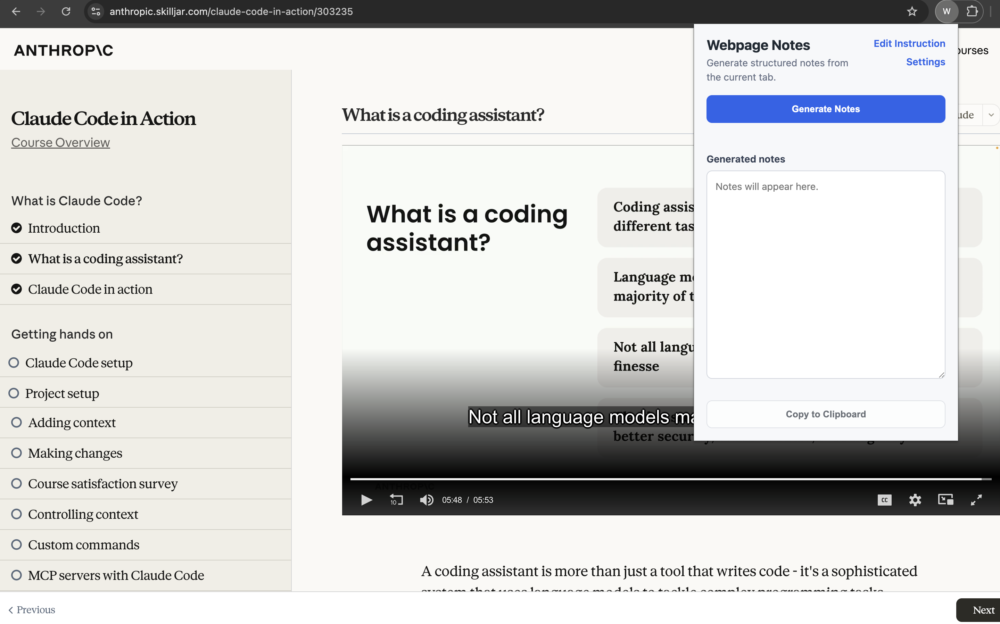
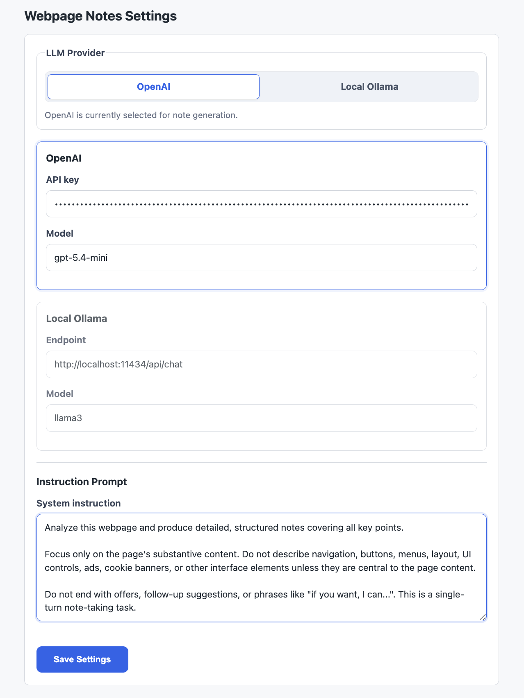

# Aladdin: Chromium based webpage note-taker with LLM for webpages that are not publicly accessible without login.

## Licensed under CC BY-NC-SA 4.0.

A Chrome Manifest V3 extension that extracts readable text from the active webpage and sends it to either the OpenAI API or a local Ollama endpoint to generate structured notes.

The extension works in Chromium-based browsers, including Google Chrome and Brave.

## Demo

The popup runs directly on the current tab and generates notes from the page content.



The settings page lets users choose the LLM provider, configure model details, and edit the instruction prompt.



## Features

- Extracts text from the current active tab on demand.
- Uses `article`, `main`, or `[role="main"]` content when available, then falls back to `document.body.innerText`.
- Supports OpenAI chat completions and local Ollama chat endpoints.
- Stores user settings in `chrome.storage.local`.
- Lets users edit the system instruction prompt.
- Truncates extracted page content to about 12,000 words before sending it to the selected LLM.
- Shows clear popup errors for missing API keys, unreachable endpoints, auth failures, rate limits, empty pages, and empty model responses.
- Includes a copy-to-clipboard button for generated notes.
- Uses no external dependencies, build tools, bundlers, or npm packages.

## Project Structure

```text
.
├── manifest.json      # Chrome extension manifest, permissions, background worker, popup/options entries
├── background.js      # MV3 service worker; extracts page text and calls OpenAI or Ollama
├── content.js         # Injected script that returns readable page text
├── popup.html         # Extension popup UI
├── popup.js           # Popup behavior, loading state, copy button, note generation trigger
├── options.html       # Settings page UI
├── options.js         # Settings persistence and provider toggle behavior
└── styles.css         # Shared popup/options styling
```

## Architecture

This is a plain Manifest V3 extension with a popup, options page, service worker, and on-demand content script injection.

### Manifest

[manifest.json](manifest.json) declares:

- `manifest_version: 3`
- `activeTab` permission to access the currently active tab after user interaction.
- `scripting` permission to inject `content.js`.
- `storage` permission to persist provider, model, endpoint, API key, and prompt settings.
- Host permissions for:
  - `https://api.openai.com/*`
  - `http://localhost:*/*`
  - `http://127.0.0.1:*/*`

### Popup

[popup.html](popup.html) and [popup.js](popup.js) implement the main user workflow:

1. User clicks **Generate Notes**.
2. Popup sends a `GENERATE_NOTES` message to the background service worker.
3. Popup displays loading state while the LLM request is running.
4. Popup renders the returned notes or a clear error message.
5. User can copy generated notes to the clipboard.

The popup also includes:

- **Settings** link to open the full options page.
- **Edit Instruction** link to open the options page directly at the editable instruction prompt.

### Options Page

[options.html](options.html) and [options.js](options.js) provide extension settings:

- Provider toggle: **OpenAI** or **Local Ollama**.
- OpenAI API key.
- OpenAI model name, defaulting to `gpt-4o`.
- Ollama endpoint, defaulting to `http://localhost:11434/api/chat`.
- Ollama model name, defaulting to `llama3`.
- Editable instruction prompt.

All settings are saved in `chrome.storage.local`.

The default prompt tells the model to focus on substantive page content, avoid describing UI/navigation/buttons/layout, and avoid ending with follow-up offers such as "if you want, I can...".

### Content Extraction

[content.js](content.js) is injected only when the user clicks **Generate Notes**.

Extraction strategy:

1. Try `article`.
2. Try `main`.
3. Try `[role="main"]`.
4. Fall back to `document.body`.

The script returns cleaned `innerText` to the background worker.

### Background Service Worker

[background.js](background.js) handles the main orchestration:

1. Receives `GENERATE_NOTES` from the popup.
2. Finds the active tab in the current browser window.
3. Rejects restricted browser pages such as `chrome://`, `brave://`, `about:`, and extension pages.
4. Injects `content.js` with `chrome.scripting.executeScript`.
5. Reads settings from `chrome.storage.local`.
6. Truncates extracted content to about 12,000 words.
7. Calls the selected LLM provider.
8. Returns notes and any truncation warning to the popup.

## LLM Providers

### OpenAI

The OpenAI integration calls:

```text
POST https://api.openai.com/v1/chat/completions
```

Request shape:

```json
{
  "model": "gpt-4o",
  "messages": [
    { "role": "system", "content": "..." },
    { "role": "user", "content": "..." }
  ],
  "temperature": 0.2
}
```

The API key is supplied by the user in the options page and sent as:

```text
Authorization: Bearer <OPENAI_API_KEY>
```

The key is never hardcoded in this repo.

### Local Ollama

The Ollama integration calls the configured endpoint, defaulting to:

```text
POST http://localhost:11434/api/chat
```

Request shape:

```json
{
  "model": "llama3",
  "messages": [
    { "role": "system", "content": "..." },
    { "role": "user", "content": "..." }
  ],
  "stream": false
}
```

Make sure Ollama is running locally and that the selected model is available.

## Privacy and Security Notes

- Page text is sent to the selected provider when the user clicks **Generate Notes**.
- OpenAI requests send page content to `https://api.openai.com`.
- Ollama requests send page content to the configured local endpoint.
- OpenAI API keys are stored in `chrome.storage.local`, which is local to the browser profile.
- Do not commit API keys or other credentials to the repository.

## Install From a Local Clone

### 1. Clone the Repository

```bash
git clone <repository-url>
cd ChromeExtensionAladin
```

### 2. Load in Google Chrome

1. Open `chrome://extensions`.
2. Enable **Developer mode**.
3. Click **Load unpacked**.
4. Select the cloned project directory.
5. Pin the extension from the browser toolbar if desired.

### 3. Load in Brave

1. Open `brave://extensions`.
2. Enable **Developer mode**.
3. Click **Load unpacked**.
4. Select the cloned project directory.
5. Pin the extension from the browser toolbar if desired.

## Configure the Extension

1. Click the extension icon.
2. Click **Settings**.
3. Choose **OpenAI** or **Local Ollama** in the provider toggle.
4. For OpenAI:
   - Enter your OpenAI API key.
   - Confirm or edit the model name.
5. For Ollama:
   - Confirm or edit the local endpoint.
   - Confirm or edit the model name.
6. Review or edit the instruction prompt.
7. Click **Save Settings**.

## Use the Extension

1. Open any normal webpage.
2. Click the extension icon.
3. Click **Generate Notes**.
4. Wait for the model response.
5. Copy the generated notes if needed.

The extension cannot read browser-internal pages such as `chrome://extensions`, `brave://settings`, or `about:blank`.

## Development

No build step is required. Edit the files directly and reload the unpacked extension from the browser extensions page.

Useful local checks:

```bash
node --check background.js
node --check popup.js
node --check options.js
node --check content.js
node -e "JSON.parse(require('fs').readFileSync('manifest.json', 'utf8')); console.log('manifest ok')"
```

After changing extension files, click the reload button for the unpacked extension in `chrome://extensions` or `brave://extensions`.
